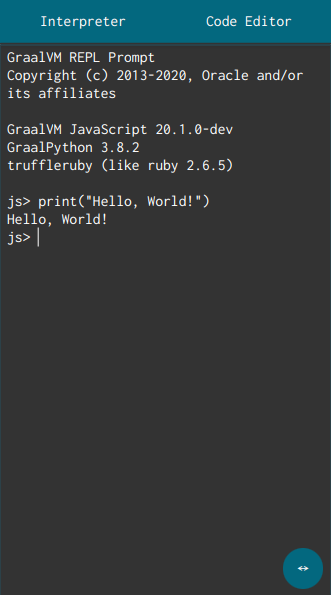
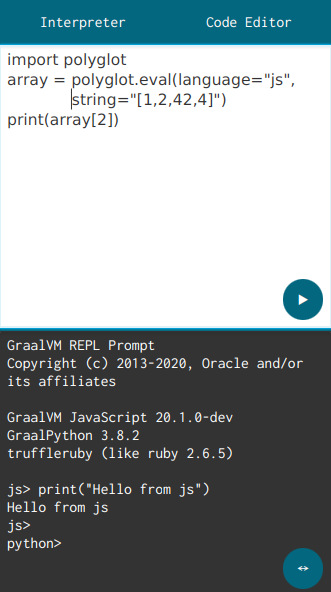

# GraalVM REPL 
REPL (read–eval–print loop) shell built ontop of JavaFX stack, GraalJS, GraalPython, TruffleRuby and FastR




## Building prerequisites
* Up-to-date **GraalVM** with `GRAALVM_HOME` environment variable set. It can be obtained either in binary form from [here for nightly versions](https://github.com/graalvm/graalvm-ce-dev-builds/releases) or [here for stable versions](https://github.com/graalvm/graalvm-ce-builds/releases), or built from source (ideally using [this script](https://gist.github.com/lazar-mitrovic/94430814332adae7d5eaf51907b77379))

* `native-image`
    * If you are using *stable* or *nightly* version of GraalVM you can obtain it using:

        ```bash
        gu install native-image
        ```

* Truffle languages: [GraalJS](https://github.com/graalvm/graaljs), [GraalPython](https://github.com/graalvm/graalpython), [TruffleRuby](https://github.com/oracle/truffleruby), [FastR](https://github.com/oracle/fastr). Any combination of those will work, provided that `pom.xml` is edited accordingly.

    * If you are using *stable* or *nightly* version of GraalVM you can obtain them using:

        ```bash
        gu install python
        gu install ruby
        gu install R
        ```

    * If you are building from source you can include them as mx dynamic imports:

        ```bash
        cd $GRAAL_SOURCE/vm # Assuming that GRAAL_SOURCE points to right location

        export FASTR_CAPTURE_DEPENDENCIES
        export FASTR_RELEASE=true
        export FASTR_NO_RECOMMENDED=true
        export PKG_LDFLAGS_OVERRIDE="-L/lib/x86_64-linux-gnu -L/usr/lib/x86_64-linux-gnu"

        mx --dynamicimports /graal-js,graalpython,truffleruby,fastr,/substratevm build
        ```
* Various other dependencies (which might or might not be needed): [look here](https://gist.github.com/lazar-mitrovic/94430814332adae7d5eaf51907b77379#file-buildgraal-py-L28-L69)

* `native-image-agent` in order to generate required reflection configuration in JVM mode.

### Notice:
If you are building from source both languages and `native-image` can be built using [aforementioned script](https://gist.github.com/lazar-mitrovic/94430814332adae7d5eaf51907b77379) by simply running:

```bash
./buildGraal.py --dynamicimports /graal-js,graalpython,truffleruby,fastr,/substratevm
```

## Choosing languages

Go to `pom.xml` in project root and edit `nativeImageArgs` so that languages you have installed are uncommented (with `!` removed), and that others are commented out.

So if you only have `graalpython` installed, your configuration would look like this:
```xml
                    <nativeImageArgs>
                        <!--<list>-!-language:js</list>-->
                        <list>--language:python</list>
                        <!--<list>-!-language:ruby</list>-->
                        <!--<list>-!-language:R</list>-->
                        ...
```
## JVM run workflow
```bash
mvn clean javafx:run
```

(this will generate required reflection configuration - note that `native-image-agent` is required)

or if VSCode is used: `CTRL+SHIFT+B` / `⇧⌘B` -> `Run JVM`

### Debug
```bash
mvn clean javafx:run@debug
```

or if VSCode is used: install `Debugger for Java` extension and then press `F5`

## Native-image build workflow
|  Platform | Commands  |
|----------	|---|
| Desktop: 	|`mvn clean client:build client:package client:run`|
| Android: 	|`mvn -Pandroid clean client:build client:package client:install client:run`|
| iOS:      |`mvn -Pios clean client:build client:package client:install client:run`|

or if VSCode is used:

`CTRL+SHIFT+B` / `⇧⌘B` -> `Build (<platform>)`

`CTRL+SHIFT+B` / `⇧⌘B` -> `Run (<platform>)`
