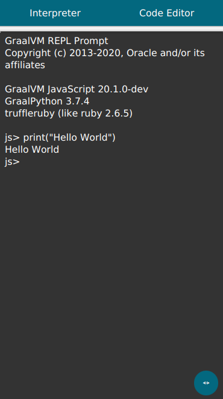

# GraalVM REPL
REPL (read–eval–print loop) shell built ontop of JavaFX stack, GraalJS, GraalPython, TruffleRuby and FastR

<center> 



</center>

## Building prerequisites
* Up-to-date GraalVM (for mobile builds [this fork](https://github.com/gluonhq/graal) might be best, prebuilt binaries for [linux](https://download2.gluonhq.com/substrate/graalvm/graalvm-svm-linux-20.1.0-latest.zip) and [macOS](https://download2.gluonhq.com/substrate/graalvm/graalvm-svm-darwin-20.1.0-latest.zip) are provided)
* `GRAALVM_HOME` environment variable set (optimally `JAVA_HOME=$GRAALVM_HOME`, which should help with `The import org.graalvm cannot be resolved` error)
* [GraalJS](https://github.com/graalvm/graaljs), [GraalPython](https://github.com/graalvm/graalpython), [TruffleRuby](https://github.com/oracle/truffleruby), [FastR](https://github.com/oracle/fastr). Any combination of those will work, provided that `pom.xml` is edited accordingly. Those can be added either by `gu install` (on stable versions) or better by adding them as dynamic mx imports - 

      cd $GRAAL_SOURCE/vm # Assuming that GRAAL_SOURCE points to right location
      env FASTR_RELEASE=true mx --dynamicimports /graal-js,graalpython,truffleruby,fastr build


* Various other Ubuntu 18.04 dependencies (which might or might not be needed):

      sudo apt -y install build-essential curl python git libxml2 ruby libssl-dev zlib1g-dev xorg-dev libcurl4-openssl-dev libgfortran-8-dev libgomp1 gfortran-8 libxml2 libc++-dev libpcre3 libpcre3-dev;

      sudo apt -y install libgtk-3-dev libgdk3.0-cil-dev libpangocairo-1.0-0 libpango1.0-dev libgl1-mesa-dev libatk1.0-dev libcairo-gobject2 libavcodec-dev libavformat-dev libavutil-dev libasound2-dev libpangoft2-1.0-0 libgdk-pixbuf2.0-dev;

* `native-image-agent` in order to generate required reflection configuration in JVM mode.
* `native-image`

## Choosing languages
Go to `pom.xml` in project root and edit `nativeImageArgs` so that languages you have installed are uncommented (with `!` removed), and that others are commented out. 

So if you only have `graalpython` installed, your configuration would look like this:
```xml
                    <nativeImageArgs>
                        <!--<list>-!-language:js</list>-->
                        <list>--language:python</list>
                        <!--<list>-!-language:ruby</list>-->
                        <!--<list>-!-language:R</list>-->
                        ...
```
## JVM workflow
` mvn clean javafx:run `

(this will generate required reflection configuration - note that )
### Debug
`mvn clean javafx:run@debug`

(Or if VSCode is used: install `Debugger for Java` Extension and then press F5)


## Native-image workflow
|          	|   |
|----------	|---|
| Desktop: 	|`mvn clean client:build client:package client:run`|
| Android: 	|`mvn -Pandroid clean client:build client:package client:run`|
| iOS:      |`mvn -Pios clean client:build client:package client:run`|